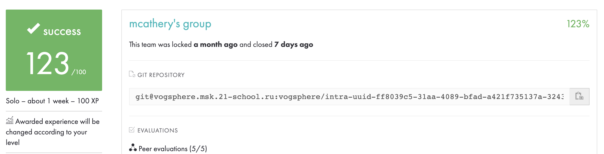

# push_swap

### Score 123/100
##### Mandatory
100/100
##### Bonus
23/25

***

### Challenge
This project's goal is to sort data on a stack, with a limited set of instructions, using
the lowest possible number of actions. To succeed you'll have to manipulate various
types of algorithms and choose the one (of many) most appropriate solution for an
optimized data sorting.
***
### The aim
I implemented more complex version of insertion algrorithm, although I used quicksort as part of my project as well.

The aim of push_swap is to sort a stack of numbers using another stack in the least commands possible. The educational aim of the project was to introduce students to advanced sorting algorithms and the concept of complexity. This project earned maximum available marks for the algortihm's efficiency.

#### Commands explanation

The stacks can be rotated, have their top two elements swapped, or be pushed onto each other, the full command list is as follows:

##### Rotating commands:
```
RA - rotate stack A (send top number on stack to bottom)
RB - rotate stack B (send top number on stack to bottom)
RR - rotate both stack A and B at the same time
RRA - counter-rotate stack A (send bottom number of stack to top)
RRB - counter-rotate stack B (send bottom number of stack to top)
RRR - counter-rotate stack A and stack B at the same time
```
##### Swapping commands:
```
SA - swap top two numbers at top of stack A
SB - swap top two numbers at top of stack B
```
##### Pushing commands:
```
PA - push top element from stack A into stack B
PB - push top element from stack B into stack A
```
###  How to run
```console
git clone https://github.com/yawwn/push_swap push_swap
cd push_swap
make

If you want to run push_swap:
ARG=`ruby -e "puts (0..100).to_a.shuffle.join(' ')"`; ./push_swap $ARG;

If you want to run checker:
ARG=`ruby -e "puts (0..100).to_a.shuffle.join(' ')"`; ./push_swap $ARG | ./checker $ARG
```
push_swap returns a list of commands to sort data. 

checker read instructions on the standard input, each instruction
followed by ’\n’. Once all the instructions have been read, checker will
execute them on the stack received as an argument and display "OK", if stack was sorted.

As a bonus you can see step by step visualization in checker. In order to see it, use -v flag. (e.g. ./checker -v "5 4 3 2 1")
(Visualizator.png)

### The algortihm

While the aim of the project was to introduce students to complexity, the project did not actually favour algorithms with lowest complexity. Given that highest marks were achieved by using the least amount of commands, slower algorithms that read the data more times could be more precise than algortihms optimised for speed or least passes over the numbers.

In my implementation, I repeatedy push numbers from Stack A to Stack B, finding the best position of a number X in Stack B. (It either can be X < min, X > max or min < X < max).
After we have only 2 numbers left in Stack A, we reverse/rotate stack B in right order and push numbers back to Stack A. 
